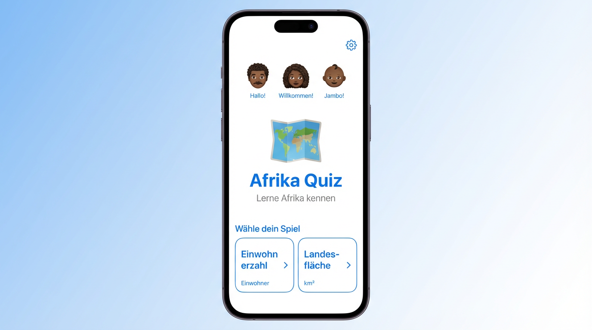
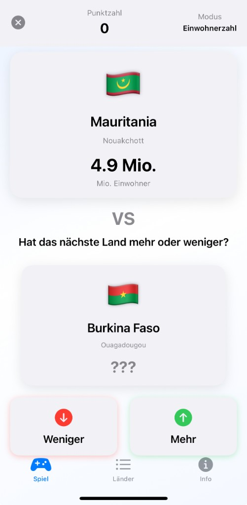
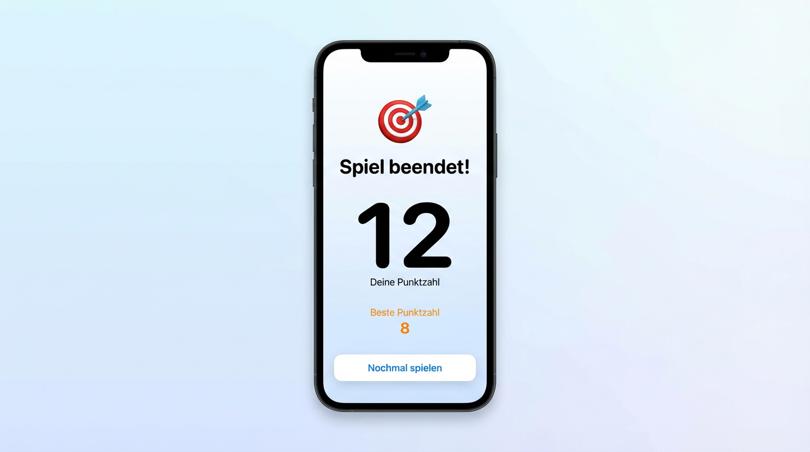

# Afrika Quiz · Africa Higher / Lower

I wanted to learn more about **Africa** and was looking for a **quick, playful way** to build knowledge. This SwiftUI app is a classic **higher / lower** game on **population** and **land area** across African countries: flags, capitals, score, and high score, with a **German** UI (“Mehr / Weniger”).

**SwiftUI iOS game** — guess whether the next country has a **higher or lower** value than the one you see. Modes: **Einwohnerzahl** or **Landesfläche**.

  
  &nbsp;&nbsp;
  
  &nbsp;&nbsp;
  

*Screenshots from the running app on iPhone.*

## What it feels like

- **Menu:** Pick **Einwohnerzahl** (population) or **Landesfläche** (area in km²). Friendly intro row and “Afrika Quiz” hero.
- **Round:** Two country cards, **VS**, hidden value on the next card until you commit to **Mehr** or **Weniger**. Score and mode in the header.
- **End:** **Spiel beendet!** with your score and best score.

## Features

| | |
|--|--|
| **Modes** | Population **or** area for all African countries in the dataset |
| **Data** | Flag emoji, capital, region — see `Models/AfricanCountry.swift` |
| **Extras** | Country list, filters, stats, info screens (SwiftUI) |

## Requirements

- **Xcode** 14+ (recommended current Xcode)
- **iOS** 15.0+ deployment target
- Open **`Africa.xcodeproj`** → select simulator or device → **Run** (⌘R)

## Repo layout

- `Africa/` — SwiftUI app sources (`Views/`, `Models/`, `AfricaApp.swift`)
- `Africa.xcodeproj` — Xcode project
- `AfricaTests` / `AfricaUITests` — tests

## Project notes

- Built for learning geography; country figures are approximate / point-in-time (see source comments).
- UI is **German**; code and comments are English/German mixed.

---

## 🇩🇪 Kurzbeschreibung (Deutsch)

Interaktive iOS-App zum Kennenlernen afrikanischer Länder im **Higher/Lower**-Stil (wie [higherlowergame.com](https://www.higherlowergame.com/)) — mit **Einwohnerzahl**- oder **Flächen**-Vergleich, Punkten, Highscore, Länderliste und Regionen.

### Technik

- **SwiftUI**, **ObservableObject** (`GameManager`), **UserDefaults** für Highscore
- **MVVM**-artige Struktur, moderne UI mit Animationen

### Installation

1. Repository klonen  
2. `Africa.xcodeproj` in Xcode öffnen  
3. Zielgerät wählen → **⌘R**

### System

- iOS 15.0+ · Xcode 14.0+ · Swift 5.7+
